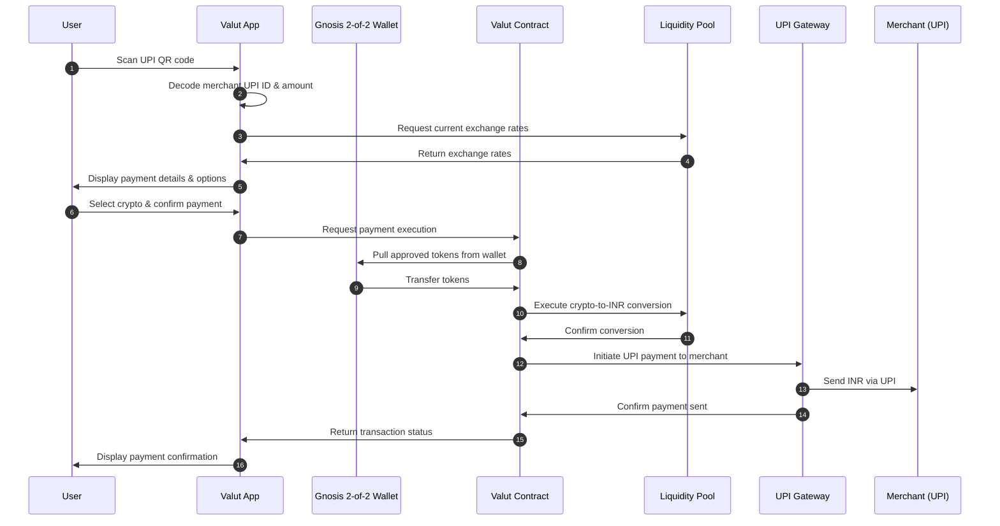

# Payment Flow

This page provides a detailed technical explanation of how a payment flows through the Valut system, from initiation to settlement.

## Overview

The Valut payment flow is designed to be seamless for both users and merchants while ensuring security, compliance, and efficient settlement. The entire process happens in seconds, allowing for a smooth user experience.

## Sequence Diagram

The following sequence diagram illustrates the complete flow of a typical payment through the Valut system:

## Detailed Step-by-Step Process

### 1. Payment Initiation

**User Actions:**
- Opens the Valut app
- Scans a UPI QR code with the phone camera
- Views the merchant details and payment amount in INR

**Technical Processing:**
- App parses the QR code to extract:
  - Merchant UPI ID
  - Payment amount (if included in QR)
  - Transaction reference (if any)
- App validates the UPI ID format
- If amount is not in QR, app prompts user to enter amount
- Backend validates merchant against blocklist for compliance

### 2. Crypto Selection & Rate Determination

**User Actions:**
- Views available cryptocurrencies in their wallet
- Sees the equivalent amount in each cryptocurrency
- Selects preferred cryptocurrency for payment

**Technical Processing:**
- App queries Valut's rate service for current exchange rates
- For each supported crypto in user's wallet:
  - Calculate equivalent amount including 2% fee
  - Display available balance
- Rate is locked for 30 seconds during user decision
- System checks if conversion amount is within liquidity constraints

### 3. Payment Authorization

**User Actions:**
- Reviews final payment details
- Confirms payment (with biometric/PIN verification)

**Technical Processing:**
- App creates signed transaction request with:
  - Merchant UPI details
  - Amount in INR
  - Selected cryptocurrency and amount
  - User authentication proof
- Request is sent to Valut's secure API
- System performs final validation checks:
  - User wallet balance 
  - Transaction limits
  - Security checks (velocity, pattern analysis)
  - Compliance verification

### 4. Token Transfer & Conversion

**Technical Processing:**
- Valut contract uses pre-approved access to pull tokens from user's Gnosis wallet
- Smart contract enforces:
  - Spending limits are not exceeded
  - Only approved tokens are transferred
  - Transfer authorization is valid
- Tokens are transferred to Valut's liquidity pool
- Conversion engine executes crypto-to-INR exchange:
  - Uses existing liquidity pools to minimize slippage
  - Applies the 2% fee
  - Records conversion details for accounting
- Conversion completes within milliseconds

### 5. UPI Payment Execution

**Technical Processing:**
- Valut's payment processor initiates UPI transfer:
  - Creates standard UPI transaction format
  - Includes merchant UPI ID
  - Sets INR amount
  - Adds transaction reference
- UPI Gateway processes the payment
- Payment is routed through India's UPI infrastructure
- Merchant receives standard UPI notification
- Funds arrive in merchant's bank account linked to UPI

### 6. Settlement & Confirmation

**Technical Processing:**
- UPI gateway returns payment status to Valut
- System records complete transaction details:
  - Transaction ID
  - Timestamp
  - Crypto amount and type
  - INR amount
  - Exchange rate used
  - Fee amount
  - Payment status
- Updates user's transaction history
- Generates digital receipt

**User Experience:**
- Receives confirmation screen with transaction details
- Gets option to view receipt or return to home screen
- Transaction appears in history immediately

## Error Handling & Edge Cases

### Insufficient Balance

If the user has insufficient cryptocurrency balance:
1. System detects this before transaction execution
2. User is notified immediately
3. Option to select different cryptocurrency or add funds
4. No partial transactions are processed

### Network Disruptions

If a network disruption occurs during payment:
1. System implements timeout handling
2. Automatic retry mechanism for certain failure types
3. If UPI payment fails after crypto is converted:
   - INR is held in escrow
   - Multiple retry attempts over 24 hours
   - Automatic refund to user's wallet if ultimately unsuccessful

### Rate Changes

If exchange rates fluctuate significantly:
1. Rates are locked for 30 seconds during user decision
2. If user takes longer, new rates are displayed before final confirmation
3. User must explicitly accept new rates
4. Circuit breakers for extreme volatility scenarios

## Special Transaction Types

### Recurring Payments

For subscription or recurring payments:
1. User pre-authorizes recurring payment with:
   - Merchant details
   - Maximum amount per transaction
   - Frequency limitations
2. Each recurring transaction follows same flow but without manual confirmation
3. User receives notification after each automatic payment

### Refunds

For payment refunds:
1. Merchant initiates standard UPI refund
2. Valut detects the refund via reference matching
3. System converts INR back to original cryptocurrency
4. User's wallet is credited with equivalent crypto (minus network fees)
5. User receives notification of completed refund

## Security Measures

Throughout the payment flow, several security measures are in place:

- **Encryption**: All communication is encrypted using TLS 1.3
- **Rate Limiting**: Prevents brute force and DoS attacks
- **Fraud Detection**: ML models analyze transaction patterns in real-time
- **Secure Element**: Biometric data and keys are stored in device secure element
- **Transaction Monitoring**: Real-time monitoring for suspicious activities
- **Authorization Timeout**: Payment authorizations expire after 60 seconds

## Performance Metrics

Valut's payment flow is optimized for speed and reliability:

- **Average Transaction Time**: < 3 seconds from confirmation to completion
- **Success Rate**: 99.7% of transactions complete successfully on first attempt
- **Availability**: 99.99% system uptime (SLA commitment)
- **Scalability**: Architecture supports 1000+ transactions per second

[Next: Security Model →](security-model.md)
