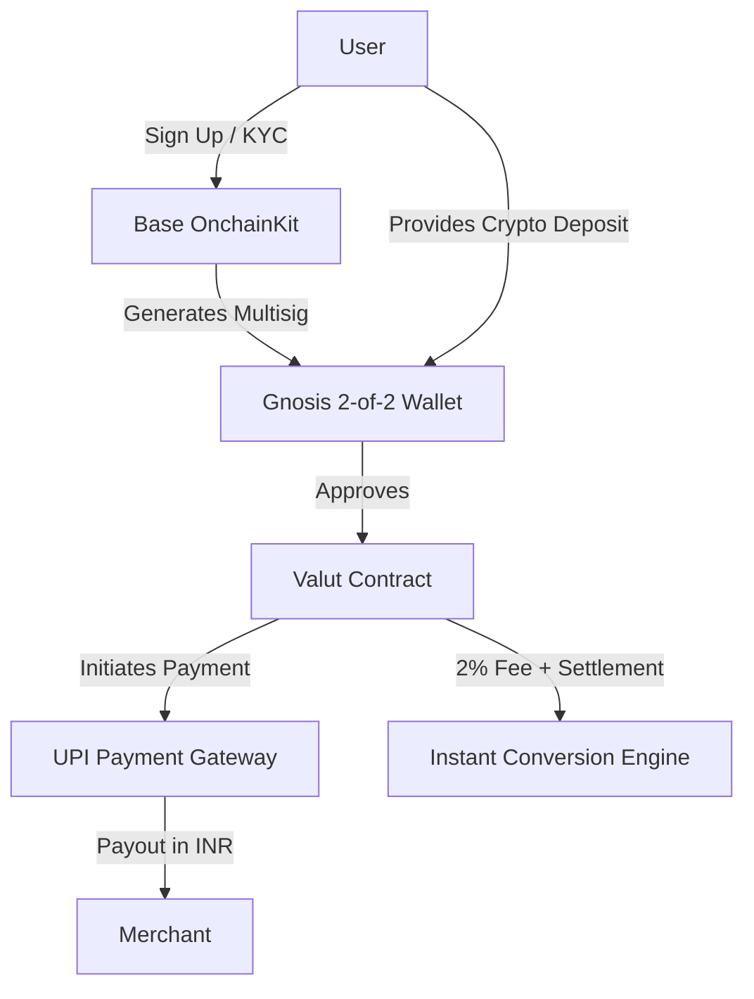
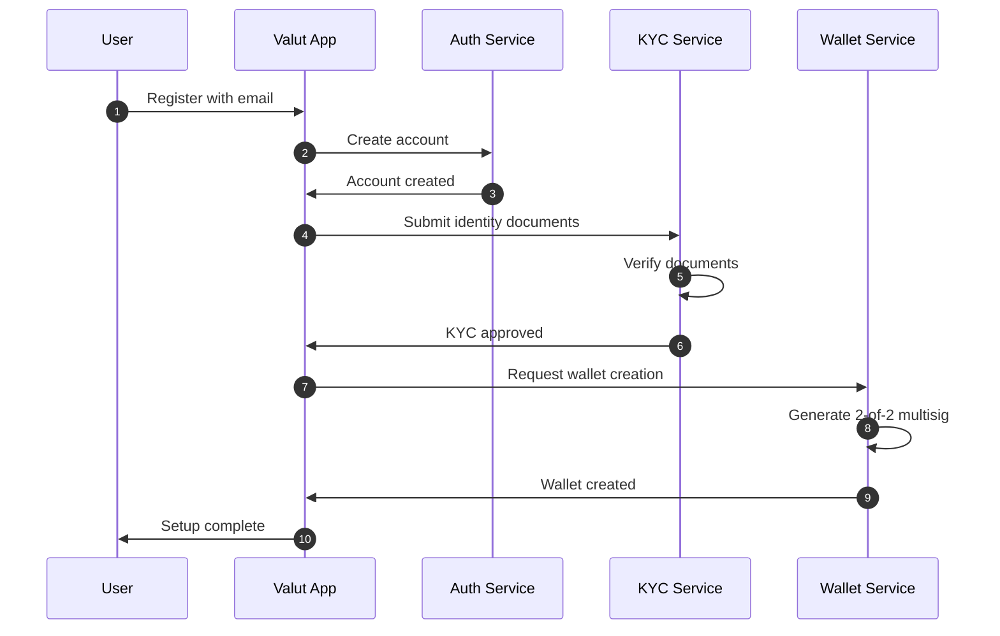
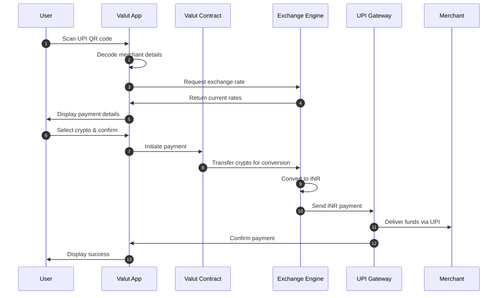

# System Architecture

This page provides a comprehensive overview of Valut's system architecture, designed to bridge the gap between cryptocurrencies and India's UPI payment system.

## High-Level Architecture Overview

Valut's architecture consists of several core components working together to enable seamless crypto-to-UPI payments:

## Core Components

### 1. User-Facing Mobile Application

The Valut mobile app provides:
- QR code scanning functionality
- Wallet management interface
- Transaction history and analytics
- User authentication and security features
- Selection of cryptocurrencies for payment

**Tech Stack:**
- React Native for cross-platform functionality
- biometrics integration for enhanced security
- Local storage with encryption for sensitive data

### 2. Base OnchainKit Integration

For identity verification and wallet generation:
- Handles user registration and identity verification
- Manages KYC/AML procedures
- Provides a secure foundation for wallet creation
- Ensures regulatory compliance with Indian financial regulations

### 3. Gnosis Safe Multisig Wallet

Each user's assets are secured by:
- 2-of-2 multisig wallet architecture
- Shared control between user and Valut platform
- Non-custodial design for enhanced security
- Threshold signature mechanisms

This architecture ensures that:
- Neither party can unilaterally move funds
- User funds remain secure even if one key is compromised
- Provides cryptographic proof of transaction authorization

### 4. Valut Smart Contract

The central contract system that:
- Holds pre-approved access to user assets
- Manages transaction execution
- Enforces spending limits and security rules
- Orchestrates the payment flow

**Key Technical Features:**
- ERC-20 token handling
- Configurable spending limitations
- Gas optimization for cost efficiency
- Upgrade mechanisms for future enhancements

### 5. Liquidity Pools and Exchange Engine

For instant crypto-to-INR conversion:
- Maintains liquidity pools for supported cryptocurrencies
- Sources real-time exchange rates from multiple providers
- Executes conversions with minimal slippage
- Manages risk from market volatility

### 6. UPI Payment Gateway Integration

The bridge to India's payment infrastructure:
- Connects to UPI payment rails
- Formats transactions to UPI specifications
- Manages merchant payouts in INR
- Monitors transaction status and confirmations

### 7. Backend Infrastructure

Supporting all operations:
- API Gateway for client communication
- Microservices architecture for scalability
- Database layer for transaction records
- Caching layer for performance optimization
- Monitoring and logging systems

## Data Flow

### User Registration Flow

### Payment Flow

## Security Architecture

Valut implements multiple layers of security:

### User-Level Security
- Biometric authentication
- PIN/password protection
- Device binding options
- Session management

### Transaction-Level Security
- Configurable spending limits
- Suspicious transaction monitoring
- Velocity checks and anomaly detection
- Time-locked operations for high-value transfers

### Infrastructure Security
- End-to-end encryption for all communications
- Regular security audits and penetration testing
- HSM (Hardware Security Module) for key management
- Multi-region redundancy and disaster recovery

## Scalability Considerations

Valut's architecture is designed for scale:

- Horizontal scaling capabilities across all services
- Load balancing for high-traffic scenarios
- Database sharding strategies for growth
- Caching layers to minimize repeat computations
- Asynchronous processing for non-critical operations

## Integration Touchpoints

### External System Integrations
- UPI payment network connectivity
- Cryptocurrency exchange APIs
- Blockchain node connections
- KYC/AML verification services
- Banking partners for INR liquidity

### API Architecture
- RESTful API design for client communication
- WebSocket connections for real-time updates
- GraphQL endpoints for data-intensive operations
- Webhook support for event notifications

## Monitoring and Operations

Valut maintains robust systems for:

- Real-time transaction monitoring
- Performance metrics dashboards
- Anomaly detection and alerting
- Automated recovery procedures
- 24/7 operations team coverage

## Future Architectural Considerations

The architecture is designed with flexibility for future enhancements:

- Support for additional blockchain networks
- Integration with emerging payment systems
- Enhanced security features
- Scaling to support higher transaction volumes
- Cross-border payment capabilities

[Next: Payment Flow →](payment-flow.md)
